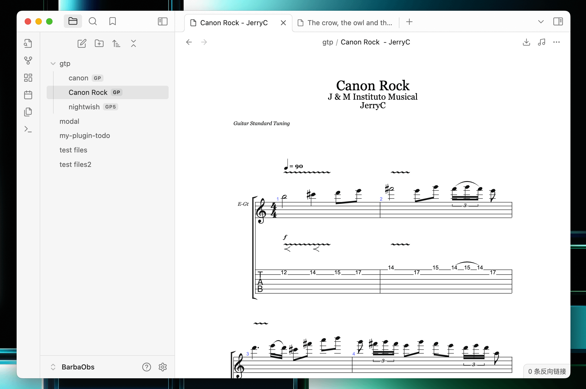

# Obsidian Guitar Pro Preview Plugin

[Obsidian](https://obsidian.md) plugin which renders `Guitar Pro` files (`gtp/gp/gp5/gpx`).
Based on AlphaTab(https://alphatab.net/).

## Examples
1. Open the `Guitar Pro` file directly.

2. Change the track, and support rendering multiple tracks.

3. Download midi file.